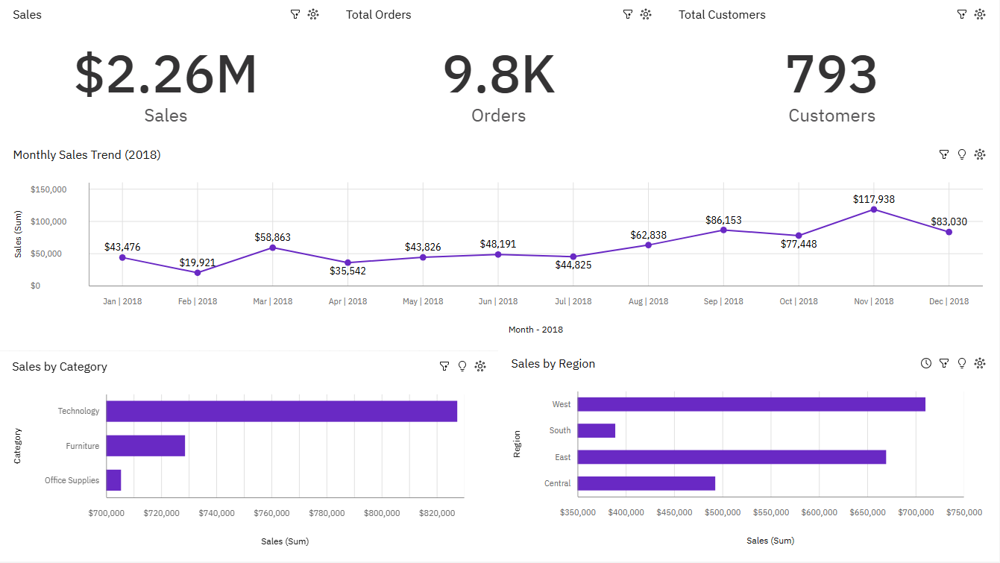

# retail-sales-cognos-dashboard
Retail Sales Dashboard built using IBM Cognos Analytics using Superstore Sales dataset from Kaggle

# **Project Overview**

This project presents an interactive retail sales dashboard built using IBM Cognos Analytics. The dashboard analyzes sales performance across time, product categories, and geographic regions using the Superstore sample dataset.

## **Tools Used**

- IBM Cognos Analytics

- Microsoft Excel

- CSV Dataset (Superstore Sales Dataset)

## **Dashboard Features**

- KPI Metrics: Total Sales, Total Orders, Total Customers

- Monthly Sales Trend Analysis (2018)

- Sales Breakdown by Product Category

- Sales Distribution by Region

- Interactive Filters (Region, Category, Time)

## **Key Insights**

- Technology category generated the highest total sales

- Sales peaked during Q4, especially November

- West and East regions contributed the highest revenue share

## **Dashboard Preview**

## **Dataset**

Superstore Sales Dataset ([Public sample dataset commonly used for BI training and analytics practice](https://www.kaggle.com/datasets/rohitsahoo/sales-forecasting?resource=download))

## **Data Preparation**

Data was cleaned and transformed using IBM Cognos Analytics Data Module.

Transformations included:

- Extracting Year and Month from Order Date

- Creating Month Name fields for reporting

- Preparing fields for dashboard aggregation

